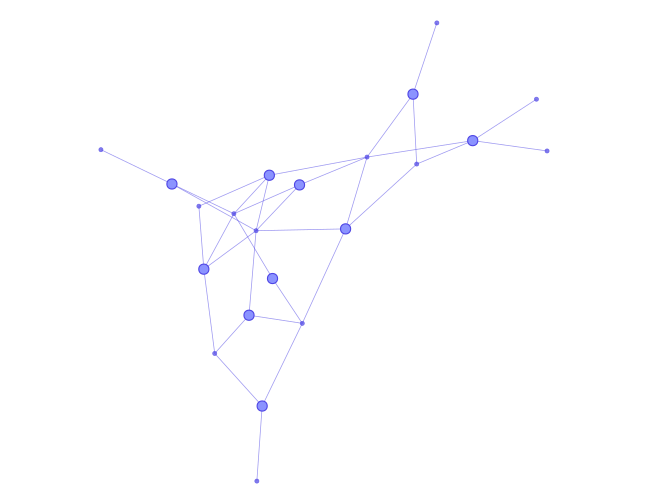

```{r}
#| include: false
source("R/home.R")
projects <- read_projects()
project_network_svg(projects, "files/hero-network.svg")
```

::: {.hero .column-screen .page-columns .page-full}


::: {.hero-inner .column-body}
[Data Analyst · Insights & Reporting · Melbourne]{.hero-eyebrow}

# Messy data in. Decisions out. {.hero-title .no-anchor}

::: hero-lead
I'm Ishita, a Monash Business Analytics graduate who finds the story worth acting on. Most recently I rebuilt a CRM of **17,554 company records**, cutting it to **11,749 (−33%)**, linking **38,171 contacts** to the right company and reducing unclassified records by **over 60%**, so campaigns finally reached the right people.
:::

::: hero-typed
I analyse data for <span class="typer" data-words='["banking &amp; fraud", "customer &amp; CRM", "healthcare", "retail", "e-commerce", "public health"]'>banking &amp; fraud</span>
:::

::: hero-actions
[See my work](projects.qmd){.btn .btn-primary .btn-lg} [Download CV](files/Ishita_Khanna_2026.pdf){.btn .btn-outline-primary .btn-lg target="_blank"}
:::
:::
:::

```{r}
#| output: asis
cat(impact_html())
```

## How my toolkit matches the market {.section-title}

::: section-intro
Each row is a tool that data analyst employers ask for. Darker cells mean stronger evidence, from job-ad demand to where I've used it. Hover or tap a cell for the details.
:::

```{r}
#| output: asis
cat(skills_heatmap_html(projects))
```

## Recent work {.section-title}

::: {#recent-work}
:::

[See all projects →](projects.qmd){.see-all}

::: closing
This portfolio grows with my **30 Days, 30 Industries** challenge: one industry, one dataset, one dashboard at a time. [Follow along on GitHub →](https://github.com/ishitak22/30-days-industry-analytics)
:::
