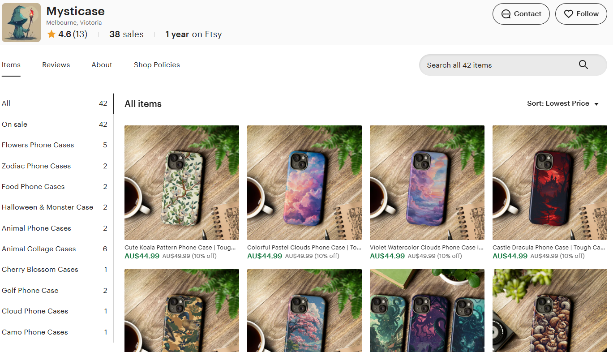
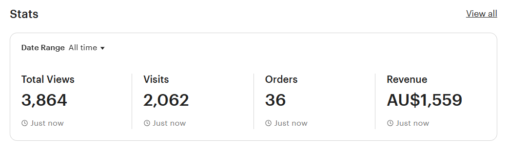
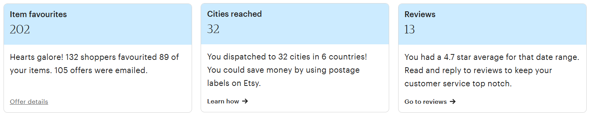

  <figure>
    
  </figure>

## <i class="bi bi-palette"></i>Where Data Meets Design

Mysticase was a small creative side business I co-launched on Etsy to explore how analytics and design come together in real-world ecommerce.

As a side project, Mysticase allowed me to use the analytical skills I gained during my Master's to explore the intersection of design, data, and online retail.

## <i class="bi bi-list-check"></i>What I did as part of Mysticase:

- Created all product imagery with design tools and automated mockup generation.  
- Used **Etsy SEO** strategies including keyword testing, titles, and tags.  
- Regularly reviewed analytics to improve conversion and discover trends.  
- Used **Google Trends** and **Etsy search data** to target low-competition niches.
- Built lightweight workflows to automate Etsy listing creation and dynamic pricing updates.

## <i class="bi bi-graph-up-arrow"></i>Performance Overview

 <figure>
    
    <figcaption>
      Mysticase Store Metrics: 2,000+ visits and $1,500+ in revenue
    </figcaption>
  </figure>

 <figure>
    
    <figcaption>
      Mysticase Reach Metrics: 200+ favourites and 32 cities reached
    </figcaption>
  </figure>

---

It was never meant to be a large-scale commercial business, but rather an agile side project to:

- Apply **marketing data analytics** in a practical setting  
- Understand **customer behavior** and analyse through real-time data  
- Develop **SEO and product strategy** based on insights showcasing insights analysis skills 
- Communicating through both **data and design**

*This initiative was a fun, self-directed application of the skills I developed during my data analytics Master's — and a way to keep learning creatively outside work. The shop has since closed, but the lessons in SEO, conversion analysis and product strategy carry into my analytics work today.*