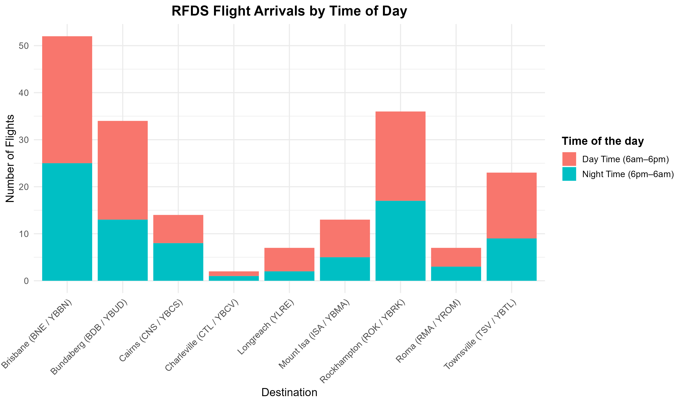

This project investigates the patterns in flight arrivals at **RFDS bases across Australia** using flight logs from July 2022.

Two core visual explorations are included:

-   **Bar Chart** of flight arrivals categorised by time of day (Day vs Night)
-   **Interactive Map** of base activity and aircraft operations using Leaflet

------------------------------------------------------------------------

## <i class="bi bi-graph-up"></i>Flight Arrivals by Time of the Day

We first examine RFDS flights landing at bases in Queensland, grouped by aircraft and arrival timestamps.

<figure>



<figcaption style="text-align:center;">

Day vs Night Arrivals at selected RFDS Bases

</figcaption>

</figure>

> Day: 6 AM - 6 PM, Night: 6 PM - 6 AM

------------------------------------------------------------------------

## <i class="bi bi-geo-alt"></i>Interactive Base Activity Map

Use the dropdown to explore RFDS base locations and view flight details by aircraft type

::: {.column-screen-inset .embed-wide .embed-fit}
<iframe src="https://ishitakhanna.shinyapps.io/rfds_network_visualisation/" width="100%" height="700px" style="border:none;">

</iframe>
:::

------------------------------------------------------------------------

## <i class="bi bi-link-45deg"></i>Resource

-   [GitHub Repository](https://github.com/ishitak22/rfds_network_visualisation)

------------------------------------------------------------------------

*Analysis performed using R packages: `dplyr`, `ggplot2`, `leaflet`, `shiny`, `lubridate`, `readr`.*

------------------------------------------------------------------------

## <i class="bi bi-lightbulb"></i>What I noticed

Brisbane was by far the busiest destination, with 52 arrivals in the month. Rockhampton (36) and Bundaberg (34) came next, then there's a big drop to places like Charleville, which only had 2.

The part that stayed with me is how much of this work happens at night. Close to half of Brisbane's arrivals (25 of 52) landed between 6pm and 6am, and the pattern is similar at Rockhampton and Cairns. Emergencies don't keep office hours, and the flight logs show it.

```{r}
#| output: asis
source("../../R/home.R")
cat(related_projects_html())
```
