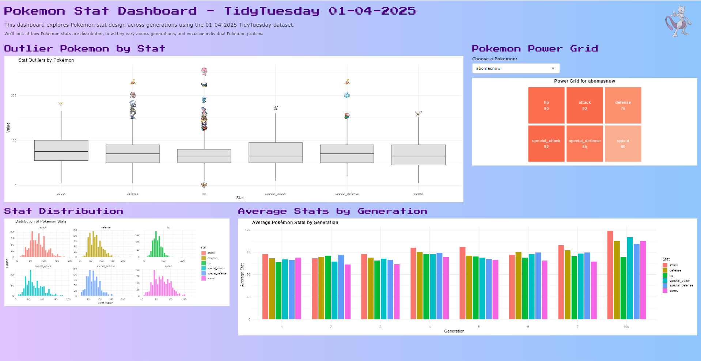

## Pokemon Stat Dashboard -- TidyTuesday 2025-04-01

This interactive dashboard visualises **Pokemon base stats** across generations using the [2025-04-01 TidyTuesday dataset](https://github.com/rfordatascience/tidytuesday/tree/main/data/2025/2025-04-01). The dashboard provides insights into stat distribution patterns, standout Pokemon outliers, average stats in generations and allows users to explore individual Pokemon stat profiles.

------------------------------------------------------------------------

## Key Features

-   📊 **Boxplot View** of stat outliers
-   ⚙️ **Interactive Power Grid** for individual Pokemon
-   🧬 **Stat Distribution Histograms** across all Pokemon
-   🌱 **Average Stat Trends** across Generations

------------------------------------------------------------------------

## 🎬 Demo Video

::: {style="text-align: center; font-style: italic;"}
Click the image below to watch the full dashboard demo video.
:::

------------------------------------------------------------------------

## Insights

-   **Special Attack and Speed** exhibit wide variation across Pokemon species
-   **Defense** is more tightly clustered
-   **Generation 7** shows the highest average stats, reflecting game evolution
-   **Outlier Pokémon** like Deoxys and Blissey showcase unique stat extremes

------------------------------------------------------------------------

## Resources

-   [GitHub Repository](https://github.com/ishitak22/tidytuesday-projects/tree/main/tidytuesday_2025-04-01)\
-   [TidyTuesday Dataset (2025-04-01)](https://github.com/rfordatascience/tidytuesday/tree/main/data/2025/2025-04-01)
-   [LinkedIn Post](https://www.linkedin.com/posts/khannaishita_tidytuesday-pokemon-tidytuesday-activity-7344152496967139328-1IQB?utm_source=share&utm_medium=member_desktop&rcm=ACoAADDaLd8BB_aQ7Ddb1JYFtgrM0vX8n2xXUBM)

------------------------------------------------------------------------

*Built using `R`, `Shiny`, `ggtext`, `ggplot2` and `httr` for styling.*
