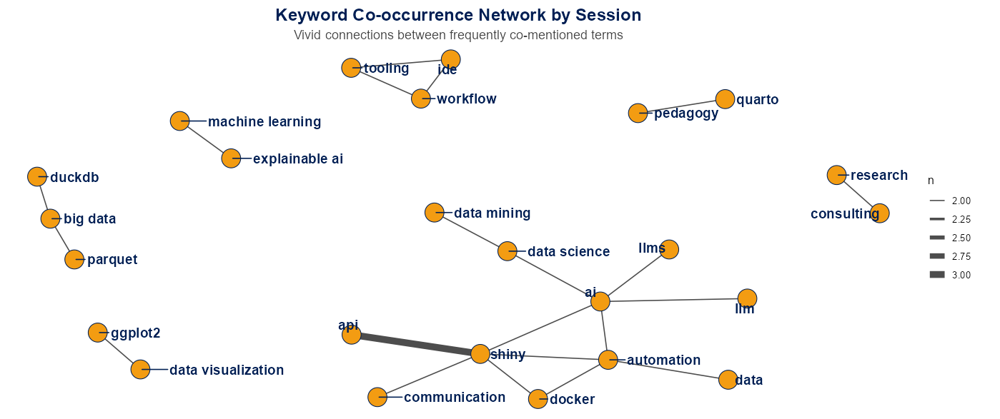

This interactive project explores how keywords were used across sessions at the **useR! 2025** conference. The goal was to analyse and visualise how topics clustered together using text mining and network analysis techniques.

## <i class="bi bi-tools"></i>Tools & Data Preparation

This analysis used the following R libraries:

-   `tidyverse` for data manipulation
-   `tidytext` for splitting keywords and keyword processing
-   `widyr` for calculating pairwise keyword co-occurrence
-   `ggraph`, `igraph`, and `tidygraph` for network visualization
-   `shiny` for interactivity

To prepare the data:

-   The dataset was cleaned by **separating comma-separated keywords** into individual rows
-   Extra whitespace and missing values were removed
-   Session-level keyword groupings were constructed using `unite()` and `pairwise_count()`
-   The final result was a **co-occurrence network**, where nodes are keywords and edges represent how often they appeared together in a session

## <i class="bi bi-bar-chart-line"></i>Explore the Top Keywords

::: {.column-screen-inset .embed-wide .embed-fit}
<iframe src="https://ishitakhanna.shinyapps.io/tidytuesday_2025-04-29/" width="100%" height="700px" style="border:none;">

</iframe>
:::

## <i class="bi bi-diagram-3"></i>Keyword Co-occurrence Visualisation



### <i class="bi bi-link-45deg"></i>GitHub and LinkedIn

-   <i class="bi bi-github"></i> [View the GitHub repo](https://github.com/ishitak22/tidytuesday-projects/tree/fedd162bfb31fdf019463e2272885222d4312789/tidytuesday_2025-04-29)\
-   <i class="bi bi-linkedin"></i> [See my LinkedIn post](https://www.linkedin.com/posts/khannaishita_tidytuesday-dataanalytics-tidytuesday-activity-7327150472425889793-lAo7)

------------------------------------------------------------------------

## <i class="bi bi-lightbulb"></i>What I noticed

Shiny and APIs turned up together more often than any other pair of keywords, in three separate sessions. It's a nice reminder that people are using Shiny as a front end for other services, not just for standalone dashboards.

AI sits right in the middle of the network. It connects LLMs, automation, data science and Shiny, which says a lot about what was on people's minds at the conference this year.

Some topics travel in tight little groups of their own: DuckDB, big data and Parquet; Quarto and teaching; and ggplot2 with data visualisation.

```{r}
#| output: asis
source("../../R/home.R")
cat(related_projects_html())
```
